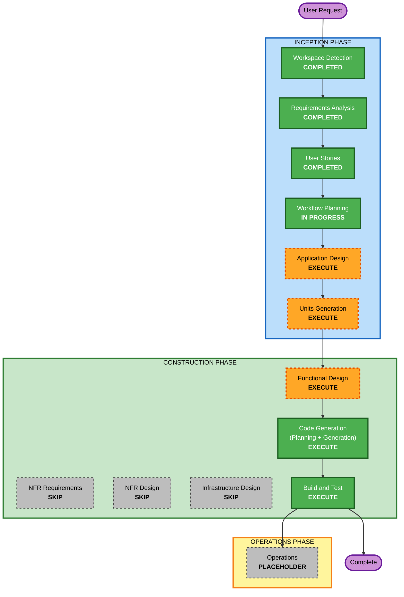

# 실행 계획 (Execution Plan)

## 상세 분석 요약

### 변경 영향 평가
- **사용자 대면 변경**: 예 — 업로드/판별/과별 대시보드/진행 상태 표기 UI
- **구조적 변경**: 예 — 신규 프로젝트, 공통 코어 + V1(웹) + V2(서버) 다중 모듈
- **데이터 모델 변경**: 예 — 판독문 레코드, 판별 결과, 진행 상태 모델 신규 정의
- **API 변경**: 예(V2) — 목록/판별 결과 조회, 진행 상태 갱신 REST API
- **NFR 영향**: 있음 — 사용성(한국어 UI), 성능(수백 건 즉시), 유지보수성(규칙 집중화), 학습 친화 구조, 코어 재사용

### 위험 평가
- **위험 수준**: Low~Medium (프로토타입, 클라이언트 사이드 우선, 규칙 기반)
- **롤백 복잡도**: Easy (V1은 정적, V2도 소규모)
- **테스트 복잡도**: Moderate (판별 규칙 정확성, 오탐 방지 케이스)

## 워크플로우 시각화

### 텍스트 대체 (다이어그램 파싱 실패 대비)
- INCEPTION: 워크스페이스 탐지(완료) → 요구사항 분석(완료) → 사용자 스토리(완료) → 워크플로우 계획(진행중) → 애플리케이션 설계(실행) → 유닛 생성(실행)
- CONSTRUCTION: 기능 설계(실행) → NFR 요구/설계/인프라 설계(생략) → 코드 생성(실행) → 빌드·테스트(실행)
- OPERATIONS: 자리표시자

## 실행/생략 단계

### 🔵 INCEPTION PHASE
- [x] 워크스페이스 탐지 (COMPLETED)
- [x] 리버스 엔지니어링 (SKIPPED - Greenfield)
- [x] 요구사항 분석 (COMPLETED)
- [x] 사용자 스토리 (COMPLETED)
- [x] 워크플로우 계획 (IN PROGRESS)
- [ ] 애플리케이션 설계 - **EXECUTE**
  - **근거**: 신규 프로젝트로 컴포넌트 경계(공통 코어의 파서/판별기, V1 UI, V2 API/저장소)와 컴포넌트 간 관계 정의 필요.
- [ ] 유닛 생성 - **EXECUTE**
  - **근거**: 시스템을 3개 유닛(공통 코어 / V1 웹 / V2 서버)으로 분해해 순차 구현. 유닛 의존성(코어 → V1/V2) 존재.

### 🟢 CONSTRUCTION PHASE
- [ ] 기능 설계 (per unit) - **EXECUTE**
  - **근거**: 데이터 모델(판독문/판별결과/진행상태), 규칙 기반 판별 로직·오탐 방지 규칙의 상세 설계 필요.
- [ ] NFR 요구 (per unit) - **SKIP**
  - **근거**: 성능/보안 요구가 프로토타입 수준으로 요구사항에 이미 확정. 보안·복원력 확장 미적용. 별도 정식 NFR 수집 불필요.
- [ ] NFR 설계 (per unit) - **SKIP**
  - **근거**: NFR 요구 생략에 따라 생략. (필요한 사용성/유지보수성은 기능 설계·코드 생성에서 반영)
- [ ] 인프라 설계 (per unit) - **SKIP**
  - **근거**: V1은 정적 호스팅, V2는 로컬 실행 가능한 단일 Node 서버 + 파일/경량 DB 수준. 클라우드 인프라 매핑 불필요(프로토타입).
- [ ] 코드 생성 (per unit) - **EXECUTE (ALWAYS)**
  - **근거**: 실제 구현.
- [ ] 빌드 및 테스트 - **EXECUTE (ALWAYS)**
  - **근거**: 빌드·판별 정확성 테스트·검증.

### 🟡 OPERATIONS PHASE
- [ ] 운영 - PLACEHOLDER

## 유닛(모듈) 개요 및 구현 순서
학습자 친화적 폴더 구조(요구 NFR-6) 기준의 예상 구성:
1. **shared-core** (공통 코어): CSV/Excel 파싱, 판독문 필터, 규칙 기반 추적관찰 판별, 근거·시점 추출, 과별 집계 로직. → 먼저 구현(다른 유닛이 의존).
2. **v1-web-serverless** (V1): shared-core를 사용하는 브라우저 UI(업로드, 대시보드, 과 탭, 표, localStorage 상태). → 코어 다음.
3. **v2-server** (V2): shared-core를 재사용하는 Node.js+TS 서버(REST API, DB 저장, 이름/과 식별) + 클라이언트 연동. → 마지막.

**업데이트 접근**: 순차 (코어 → V1 → V2). 코어가 임계 경로.

## 예상 타임라인
- **총 실행 단계**: INCEPTION 2개(앱설계, 유닛생성) + CONSTRUCTION(기능설계, 코드생성×3유닛, 빌드/테스트)
- **예상 규모**: 프로토타입 수준, 유닛별 순차 진행

## 성공 기준
- **주 목표**: 판독문에서 추적 관찰 필요 건을 규칙 기반으로 판별해 과별 대시보드/표로 표시하고 진행 상태를 표기하는 도구를 V1/V2 2버전으로 제공.
- **핵심 산출물**: shared-core 라이브러리, V1 웹앱(정적 배포 가능), V2 서버+클라이언트, 판별 규칙 세트, 테스트.
- **품질 게이트**: 판독문 필터 정확, 추적관찰 판별의 오탐(임상정보 '추적 검사') 방지 확인, 과별 집계 정확, V1 상태 localStorage 유지, V2 상태 서버 공유.
